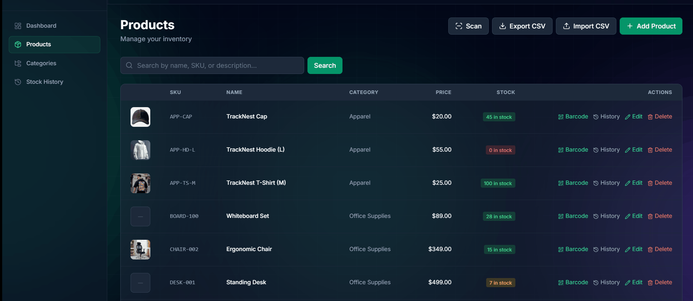
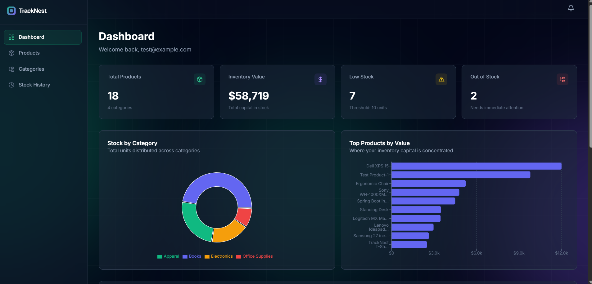
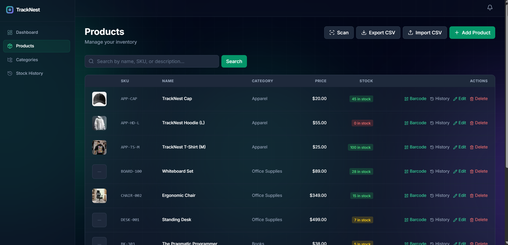
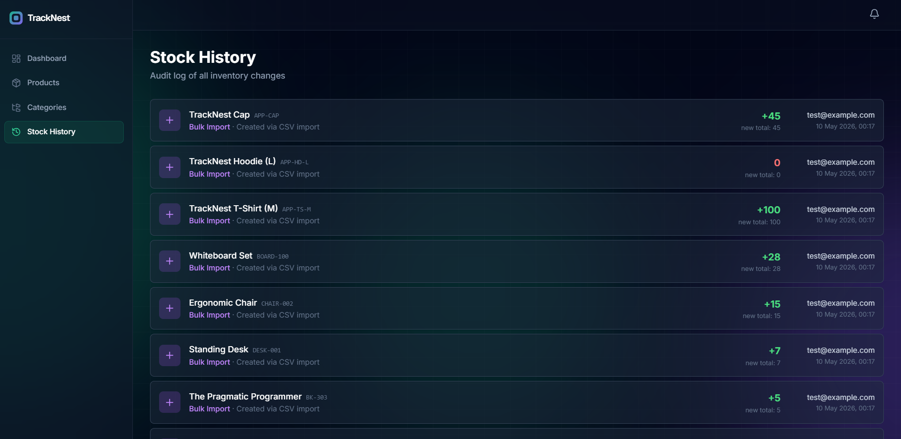
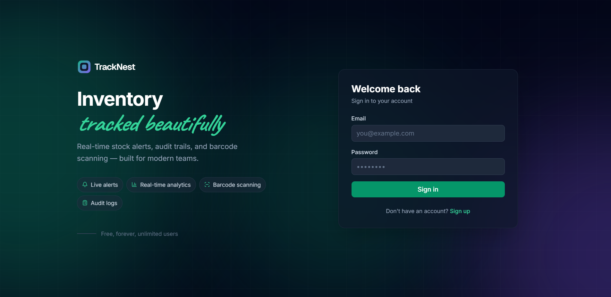
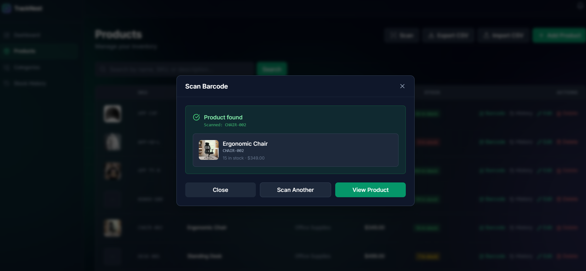
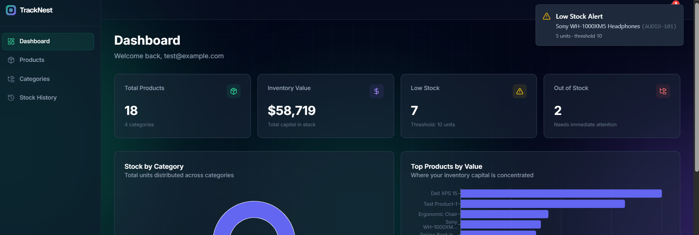

<div align="center">

# TrackNest

**A real-time inventory management system with live alerts, audit trails, and webcam barcode scanning.**

Built with Spring Boot 3, React, and a polished design system.

[▶ 2-min demo video](https://www.loom.com/share/f2ad11158919442c8c744ed262980f19)  ·  [Engineering notes ↓](#design-decisions)  ·  [Run it yourself ↓](#run-it-yourself)

</div>

<br />

<!-- HERO GIF — record a 8-12s screen capture of the barcode scanner flow -->
<p align="center">
  
</p>

<br />

## What it does

Three things you usually don't see in CRUD inventory tutorials:

🔴 **Live alerts via WebSocket.** When stock crosses a threshold — anywhere, by anyone — every connected user sees a toast within 200ms. Edge-triggered, so users aren't spammed when stock drops 5 → 4.

📷 **Webcam barcode scanning.** Point your laptop or phone camera at a UPC barcode. The matching product highlights in the table within 1 second.

📊 **Real audit trails.** Every product change creates a movement record (who, what, when, why). Per-row transactional consistency on bulk imports.

Plus: CSV import/export with partial-success error reporting, PDF report generation, drag-and-drop image uploads, an animated dashboard with Recharts.

### Three roles, three permission tiers

```
EMPLOYEE  ·  view products, view audit log, run PDF reports
MANAGER   ·  + add/edit products, bulk CSV import
ADMIN     ·  + delete products, manage categories, assign roles
```

Roles are stored as Firebase custom claims and enforced both in the API (Spring Security) and the UI (route guards + conditional buttons).

## Stack

```
Backend   ·  Spring Boot 3  ·  Java 21  ·  MySQL  ·  Firebase Auth  ·  STOMP WebSocket
Frontend  ·  React  ·  Vite  ·  Tailwind  ·  TanStack Query  ·  Framer Motion  ·  Recharts
Infra     ·  Docker Compose  ·  Cloudinary
```

A few choices in [Design Decisions](#design-decisions) below — N+1 prevention, threshold-crossing logic, the open-in-view debate, etc.

---

## Demo

> 📹 **Video walkthrough:** [Watch demo (2 min)](https://www.loom.com/share/f2ad11158919442c8c744ed262980f19)

### Screenshots

| Dashboard | Products | Stock History |
| :---: | :---: | :---: |
|  |  |  |

| Login | Barcode Scanner | Low-Stock Alert |
| :---: | :---: | :---: |
|  |  |  |

## Architecture

```
┌─────────────────┐         ┌─────────────────┐         ┌──────────────┐
│   React + Vite  │ ◄─────► │  Spring Boot 3  │ ◄─────► │    MySQL     │
│   (frontend)    │  HTTPS  │   (backend)     │  JDBC   │              │
│                 │  STOMP  │                 │         │              │
└────────┬────────┘  WS     └────────┬────────┘         └──────────────┘
         │                           │
         ▼                           ▼
   ┌──────────┐              ┌──────────────┐
   │ Firebase │              │  Cloudinary  │
   │   Auth   │              │   Storage    │
   └──────────┘              └──────────────┘
```

**Auth flow:** React handles sign-up/sign-in via Firebase Web SDK → receives an ID token → attaches it to every API request. Spring Boot's custom `FirebaseAuthFilter` verifies the token using Firebase Admin SDK and reads the `role` custom claim into Spring Security's authority context.

**Real-time alerts:** Stock changes detected in `ProductServiceImpl.save()` trigger a `LowStockAlert` via `SimpMessagingTemplate.convertAndSend("/topic/alerts/low-stock", alert)`. All connected React clients (subscribed via STOMP.js) receive the broadcast and show a toast plus add to the bell dropdown.

**Image uploads:** Frontend uploads directly to Cloudinary using an unsigned upload preset — no proxy through the backend. The resulting URL is stored on the Product entity. The browser displays Cloudinary-transformed thumbnails (`q_auto,f_auto`) for performance.

## Features in depth

### Authentication and authorization
- Firebase Auth handles email/password sign-up and sign-in
- Custom claims store the user's role (`EMPLOYEE` / `MANAGER` / `ADMIN`)
- `FirebaseAuthFilter` (custom) verifies ID tokens server-side and maps roles to Spring Security authorities
- Route guards on the React side: `<ProtectedRoute>` for auth-required pages, `<PublicRoute>` for login/signup pages
- Role-gated UI: Add/Edit only for Managers, Delete only for Admins

### Real-time WebSocket alerts
- STOMP over WebSocket with SockJS fallback
- In-memory simple broker on `/topic/*` channels
- **Threshold-crossing detection** in `ProductServiceImpl.save()`:
    - "Crossed into low-stock" — stock goes from above-10 to 1-10 → yellow toast
    - "Crossed into out-of-stock" — stock goes from positive to 0 → red toast
    - No alerts on recoveries (going back above threshold)
- Frontend uses a singleton STOMP client with auto-reconnect, heartbeats, and a custom React hook for subscriptions
- Persistent bell icon with unread count survives navigation (Zustand store)

### Audit logging
- Every product create/update creates a `StockMovement` entry
- Tracks: product, movement type (`INITIAL`, `STOCK_IN`, `STOCK_OUT`, `ADJUSTMENT`, `BULK_IMPORT`), quantity change, stock-after, performed-by email, reason, timestamp
- Per-row `@Transactional` for bulk imports (failed rows roll back independently, successful rows commit)
- Stock History page with timeline UI and per-product filtering

### CSV import/export
- **Export:** Streamed via Apache Commons CSV directly to the response writer (no in-memory buffering)
- **Import:** Best-effort with row-level validation, partial-success reporting (per-row error messages), SKU-as-natural-key upsert, audit logged with `BULK_IMPORT` movement type
- N+1 prevention: categories pre-loaded into a map, so 100-row imports use 1 category query instead of 101

### PDF reports
- iText 8 used to generate styled PDFs
- Low-stock report with configurable threshold, table of affected products, color-coded stock levels (red / yellow), branded header
- Streamed to response output stream (constant memory regardless of result size)

### Analytics dashboard
- KPI cards: total products, inventory value, low-stock count, out-of-stock count
- **Count-up animations** on numeric values, with previous-value caching across navigations
- Donut chart: stock distribution by category
- Horizontal bar chart: top 10 products by inventory value
- Recent activity feed with relative timestamps
- Data fetched via TanStack Query with 60-second stale time
- Backend uses JPA projections + JPQL aggregation queries (`COALESCE(SUM(...), 0)` to handle empty datasets)

### Barcode scanning
- Pure-browser scanning via `html5-qrcode` (no native dependencies)
- Supports both 1D barcodes (UPC, EAN, Code 128) and QR codes
- `facingMode: "environment"` prefers rear camera on phones
- Lookup by SKU; highlights the matching row in the products table for 3 seconds
- State machine UI (scanning → searching → found / not_found) with proper camera lifecycle management

### Image uploads
- Drag-and-drop or click-to-browse
- Frontend uploads directly to Cloudinary using an unsigned upload preset
- 5MB validation, in-progress feedback via XMLHttpRequest progress events
- Cloudinary URL transformations (`q_auto,f_auto,c_fill,w_60,h_60`) for adaptive thumbnails

## Design decisions

A few choices worth calling out:

### Why Firebase Auth instead of JWT?
Originally the project used JJWT-based JWT auth with `JdbcUserDetailsManager`. I migrated to Firebase Auth because:
- Email/password sign-in, password reset, email verification all come for free
- Custom claims handle role-based access without managing my own user table
- Firebase Admin SDK on the backend handles token verification with one method call
- The Firebase Web SDK manages token refresh on the frontend automatically

The trade-off: vendor lock-in. For a portfolio project that's fine. For production you'd weigh it against managing your own auth.

### Why STOMP over plain WebSocket?
Raw WebSocket is a byte stream — you have to invent your own pub/sub, message envelopes, and topic system. STOMP is a tiny messaging protocol that gives you all of that. Spring Boot's built-in support means `SimpMessagingTemplate.convertAndSend(topic, payload)` is all you need on the publishing side.

### Why threshold-crossing alerts instead of "alert if stock ≤ 10"?
Level-triggered alerts (fires while condition is true) would spam the user — every save where stock ≤ 10 would fire a new alert. Edge-triggered alerts (fires only on state change) align with what humans actually want notifications about. Same idea as hardware interrupts or state-machine transitions.

### Why open-in-view = false?
Spring's default keeps the JPA session open through view rendering, which "fixes" lazy-loading errors during JSON serialization. But it also hides N+1 query problems. I disabled it and surface those problems explicitly with `JOIN FETCH` queries — making relationships eager when needed for serialization. Better practice, faster queries, no surprises.

### Why SKU-as-barcode instead of a separate barcode column?
For this scope, SKUs are short and barcode-friendly, and avoiding dual-keying simplifies search. For real retail at scale, you'd have a separate barcode column (or many-to-many mapping since one product can have multiple UPC variants). Different scale, different structure.

### Why on-demand analytics instead of pre-computed snapshots?
At our scale (hundreds, even thousands, of products), SQL aggregations run in well under 50ms. Caching adds no value. If we had a million products and hundreds of concurrent dashboard viewers, I'd switch to scheduled snapshots in a separate analytics table — fast to read, slightly stale data. Both patterns are valid; picking based on scale is the engineering judgment.

### Why Zustand alongside TanStack Query?
Three different state types in this app, three different tools:
- **Server state** (products, categories) → TanStack Query (caching, invalidation, refetching)
- **Auth state** → React Context (read everywhere, written rarely)
- **UI state** (alert list, unread count) → Zustand (in-memory, ephemeral)

Different state has different characteristics. Treating server state as React state forces you to reinvent caching; treating UI state as server state forces unnecessary network round-trips.

## A note on hosting

> A live deployment is intentionally omitted — Spring Boot apps require continuous compute that isn't free at the scale this project runs at. The Docker Compose setup below brings the full stack up locally in under 10 minutes, and the demo video above shows every feature in action.

## Run it yourself

Two ways to run TrackNest locally.

### Option 1: Docker Compose (recommended)

The fastest way — one command brings up MySQL and the Spring Boot backend in containers. The React frontend runs separately.

**Prerequisites:**
- Docker Desktop running
- Node.js 18+ for the frontend
- A Firebase service account JSON file (see below)

**Steps:**

```bash
# Clone
git clone https://github.com/pragyan-tech/tracknest.git
cd tracknest

# Place your Firebase service account JSON at:
# inventory-system/src/main/resources/firebase-service-account.json

# Bring up backend + database
docker compose up --build

# In a separate terminal — start the frontend
cd frontend
npm install
npm run dev
```

Visit `http://localhost:5173`.

The first `docker compose up --build` takes 5-10 minutes (downloading images, building backend). Subsequent runs are instant.

### Option 2: Run locally without Docker

If you'd rather run everything natively:

**Prerequisites:**
- Java 21
- Maven 3.9+
- MySQL 8 running locally
- Node.js 18+

**Steps:**

```bash
# Set up MySQL — create the database
# (in MySQL CLI)
CREATE DATABASE inventory_directory;
# (use your existing MySQL user, or create one)

# Backend
cd inventory-system
# update src/main/resources/application.properties with your MySQL credentials
mvn spring-boot:run

# Frontend (separate terminal)
cd frontend
cp .env.local.example .env.local
# fill in Firebase config and Cloudinary cloud_name in .env.local
npm install
npm run dev
```

Visit `http://localhost:5173`.

### First-time setup

Once the app is running:

1. **Sign up** at `/signup` — creates an `EMPLOYEE` user
2. **Promote to ADMIN** — temporarily allow public access to the admin endpoint, call it once, then re-enable security:
    - Edit `SecurityConfig.java` to permit `/api/admin/set-role`
    - `POST /api/admin/set-role` with `{ "email": "you@example.com", "role": "ADMIN" }`
    - Sign out and sign back in (Firebase tokens cache claims)
    - Restore the original security on `/api/admin/set-role`
3. **Create a category** via the Categories page (Admin-only)
4. **Add products** via the UI

### Required environment configuration

**Frontend (`frontend/.env.local`):**

```bash
VITE_API_URL=http://localhost:8080/api
VITE_WS_URL=http://localhost:8080/ws

VITE_FIREBASE_API_KEY=...
VITE_FIREBASE_AUTH_DOMAIN=...
VITE_FIREBASE_PROJECT_ID=...
VITE_FIREBASE_STORAGE_BUCKET=...
VITE_FIREBASE_MESSAGING_SENDER_ID=...
VITE_FIREBASE_APP_ID=...

VITE_CLOUDINARY_CLOUD_NAME=...
VITE_CLOUDINARY_UPLOAD_PRESET=inventory_products
```

**Backend** uses environment variables in production (Docker Compose injects them). For local dev, the defaults in `application.properties` work with a standard local MySQL.

## Project structure

```
tracknest/
├── inventory-system/         # Spring Boot backend
│   ├── src/main/java/com/pragyan/inventory/
│   │   ├── config/           # WebSocket, Firebase
│   │   ├── dao/              # JPA repositories
│   │   ├── dto/              # Data transfer objects
│   │   ├── entity/           # JPA entities
│   │   ├── rest/             # REST controllers
│   │   ├── security/         # Auth filter, CurrentUser bean
│   │   └── service/          # Business logic
│   ├── Dockerfile
│   └── pom.xml
├── frontend/                 # React frontend
│   ├── src/
│   │   ├── api/              # Axios + endpoint functions
│   │   ├── components/       # Reusable UI
│   │   ├── context/          # AuthContext
│   │   ├── hooks/            # Custom hooks
│   │   ├── lib/              # Firebase, Cloudinary, STOMP, Zustand stores
│   │   └── pages/            # Route components
│   └── package.json
├── docker-compose.yml
└── README.md
```

## Roadmap

The project is feature-complete but here are some ideas for what could come next:

- **Light theme toggle** — currently dark-only. The dark theme is on-brand and on-trend (Linear, Vercel, Notion all default to dark), but a toggle would be a real engineering exercise across every Tailwind class.
- **Multi-tenant support** — separate workspaces, each with their own products and users
- **Stock forecasting** — using historical movements to predict reorder points
- **Mobile-native scanning** — a PWA shell with offline queueing for warehouse use
- **Redis caching layer** — for analytics endpoints if scaled to large datasets
- **Pre-aggregated analytics snapshots** — for sub-50ms dashboard loads at huge product counts

## Acknowledgments

- [Lucide](https://lucide.dev) for the icon set
- [Recharts](https://recharts.org) for chart primitives
- [html5-qrcode](https://github.com/mebjas/html5-qrcode) for the barcode scanner
- [Caveat](https://fonts.google.com/specimen/Caveat) and [Inter](https://fonts.google.com/specimen/Inter) for typography

---

<div align="center">

Built by **Pragyan Oza**.

[GitHub](https://github.com/pragyan-tech) · [LinkedIn](https://www.linkedin.com/in/pragyan-oza) 

</div>
